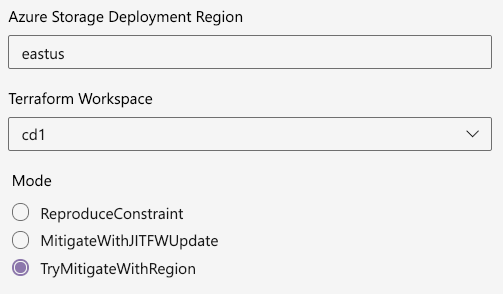

# Azure Storage same region access
 

## Private IP space
- Azure Storage uses private IP space when the client is [in the same region](https://docs.microsoft.com/en-us/azure/storage/common/storage-network-security?tabs=azure-portal#grant-access-from-an-internet-ip-range) even when Private Endpoints are not used. The client IP address as seen by the Storage Firewall is a private IP address that cannot be predicted. Hence Storage Firewall can't be used to allow/block access over the public endpoint
- Terraform will need storage data plane read access during plan stage, hence any dependency tricks during apply stage will not work

## Demonstrating the issue
- Run [deploy.ps1](./scripts/deploy.ps1) without the `-OpenStorageFirewall` parameter. This script will detect the Azure region it is run from using the Azure Instance Metadata and deploy to the same region by setting the `TF_VAR_location` environment variable.
- Run [terraform-ci-with-template.yml](./pipelines/terraform-ci-with-template.yml) with the `mode` parameter set to 'ReproduceConstraint'. This relies on [deploy.ps1](./scripts/deploy.ps1) and therefore works the same way.

## Workaround
There are 2 strategies:
- A workaround is to open up the Storage Firewall prior to Terraform plan stage. This is done using a default allow rule as the client IP address as seen by the Storage Firewall cannot be predicted. Run [terraform-ci-with-template.yml](./pipelines/terraform-ci-with-template.yml) with the `mode` parameter set to 'MitigateWithJITFWUpdate'.    
This approach is deterministic, but compromises on security.
- Another workaround is try and find a pipeline agent in a region other than the target region. An agent can run in multiple regions in the same geography (e.g. northeurope & westeurope in the EU). The pipeline will submit jobs in sequence until either an alternate region (from the deployment target) has been found or the maxmum number of attempts has been reached. Run [terraform-ci-with-template.yml](./pipelines/terraform-ci-with-template.yml) with the `mode` parameter set to 'TryMitigateWithRegion'.    
This approach is more secure, but non-deterministic.